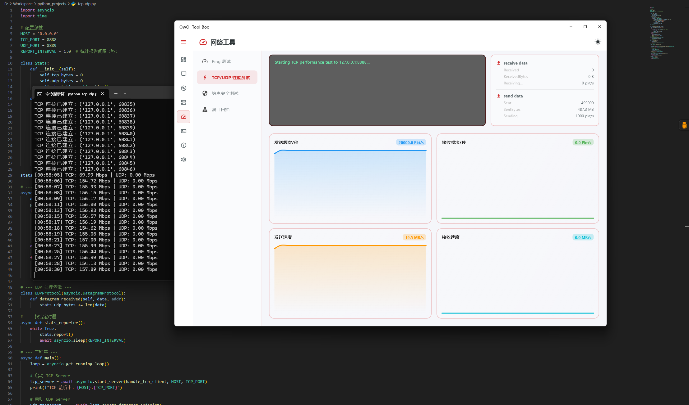
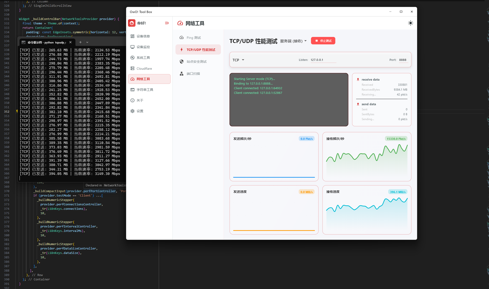
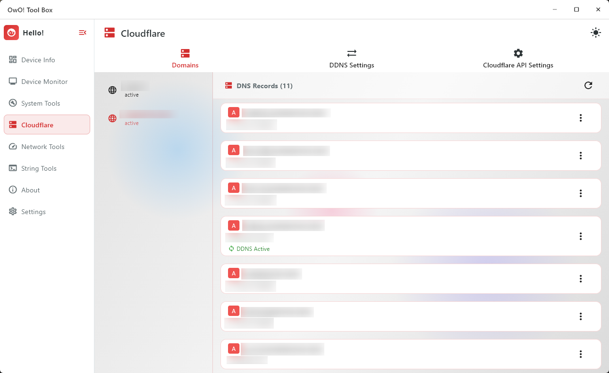
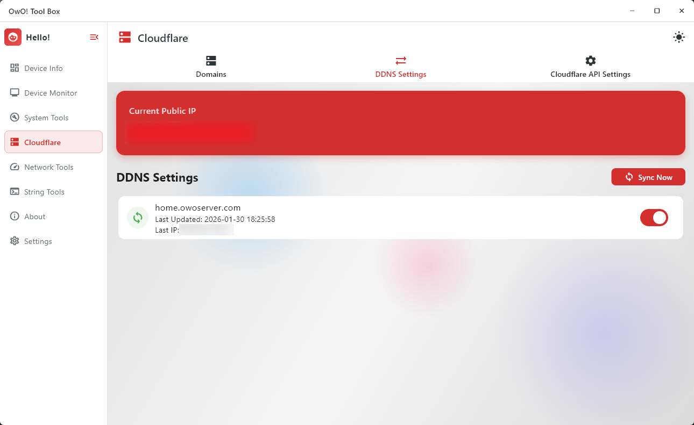
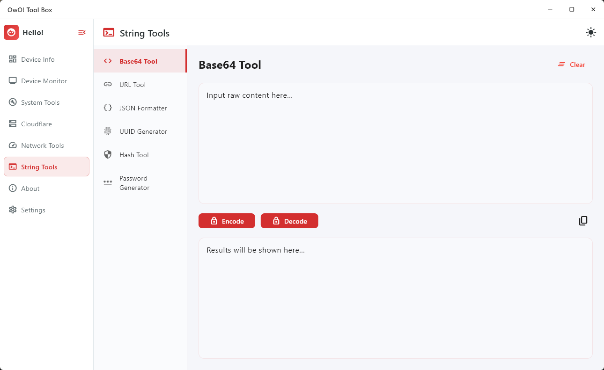

# OwO Tool Box

[新项目已迁移至这里](https://github.com/Tommy131/OwO-WinDeployer)

[English Documentation](README.md)

**OwO Tool Box** 是一个基于 Flutter 构建的多功能系统工具箱应用。它旨在为系统管理员和开发者提供一套实用的工具，目前核心功能为强大的 **主机监控 (Host Monitor)** 模块。

## ✨ 功能特性

### 🖥️ 主机监控 (Host Monitor)
一个用于监控远程服务器和主机的综合工具。
- **实时监控**：实时查看主机状态（在线、离线、认证失败）。
- **TCP 连接管理**：强大的 TCP 连接处理，支持自动重连策略。
- **安全认证**：基于令牌 (Token) 的认证系统，确保与主机的通信安全。
- **命令执行**：直接向已连接的主机发送命令。
- **批量操作**：同时监控和更新多个主机的状态。
- **警报历史**：记录警报和状态变更历史。
- **GeoIP 集成**：可视化主机地理位置信息。

- **电源管理**：轻松管理 Windows 电源计划
  - 查看当前活动的电源计划
  - 快速切换电源模式（高性能、平衡、节能）
  - 浏览并激活所有可用的电源计划
  - 系统睡眠和休眠功能
  - 精美的激活状态视觉指示器

### 🌐 Cloudflare DNS
便捷地管理您的 Cloudflare DNS 记录。
- **记录管理**：查看并更新您的区域 DNS 记录。
- **DDNS 配置**：易于使用的动态 DNS (DDNS) 设置界面。

### ⚡ 网络工具 (Network Tools)
专业的网络诊断和压力测试工具。
- **Ping 服务**：标准 ICMP Ping，支持历史记录追踪。
- **性能测试 (TCP/UDP)**：高性能打流测试，实时显示吞吐量指标和图表。
- **隔离执行**：基于 Isolate 的后台执行机制，确保 UI 在高并发测试下依然流畅响应。
- **端口扫描**：快速扫描目标主机的多个端口。
- **站点安全**：分析 HTTP 响应头和状态码，快速检查站点配置。

### 🧰 开发口袋 (Developer Pocket)
为开发者设计的字符串和数据实用工具。
- **编码/解码**：Base64, URL, Hex 转换工具。
- **格式化**：JSON 格式化和校验。
- **生成器**：支持自定义参数的 UUID 和安全随机密码生成。

### 🚀 核心特性
- **跨平台支持**：针对 Windows, macOS, Linux, Android 和 iOS 进行了优化。
- **响应式设计**：自适应布局，在桌面端和移动端都能提供流畅体验。
- **主题系统**：内置亮色和暗色模式支持，可跟随系统主题自动切换。
- **国际化**：完整的多语言支持（英文、简体中文、繁体中文、德语）。
- **定制 UI**：为桌面端提供定制的标题栏和窗口管理体验。

## 📸 应用截图

### 主机监控
| 主机监控 | 监控设置 |
|:---:|:---:|
|  |  |

| 主机详情 (概览) | 主机详情 (图表) |
|:---:|:---:|
|  |  |

| 主机详情 (终端) | 主机详情 (信息) |
|:---:|:---:|
|  |  |

### 系统工具
| 定时关机 | 电源管理 |
|:---:|:---:|
|  |  |

### 网络与 DNS
| 性能打流测试 | 端口扫描 |
|:---:|:---:|
|  |  |

| Cloudflare DDNS (列表) | Cloudflare DDNS (编辑) |
|:---:|:---:|
|  |  |

### 开发者工具
| 开发口袋 (字符串工具) |
|:---:|
|  |

### 设置与偏好
| 设置 | 主题设置 |
|:---:|:---:|
|  |  |

| 通知历史 | Windows 通知 |
|:---:|:---:|
|  |  |

## 🛠️ 技术栈

- **框架**: [Flutter](https://flutter.dev/)
- **状态管理**: [Provider](https://pub.dev/packages/provider)
- **依赖注入**: [GetIt](https://pub.dev/packages/get_it)
- **网络**: TCP Sockets, HTTP
- **存储**: Shared Preferences, Flutter Secure Storage
- **UI 组件**: FlChart, FlexColorPicker, WindowManager

## 📂 项目结构

```
lib/
├── apps/               # 独立的功能模块
│   ├── host_monitor/   # 主机监控模块
│   └── system_tools/   # 系统工具模块 (仅限 Windows)
├── core/               # 核心工具和共享组件
│   ├── constants/      # 应用常量
│   ├── i18n/           # 国际化文件
│   ├── layouts/        # 响应式布局封装
│   ├── models/         # 共享数据模型
│   ├── providers/      # 全局状态提供者
│   ├── services/       # 核心服务
│   ├── theme/          # 主题配置
│   └── widgets/        # 可复用组件
├── pages/              # 通用应用页面 (设置, 关于)
├── app.dart            # 应用入口和配置
└── main.dart           # 应用程序主入口
```

## 🚀 快速开始

### 环境要求
- [Flutter SDK](https://flutter.cn/docs/get-started/install) (建议版本 3.9.2 或更高)
- Dart SDK

### 安装步骤

1. **克隆仓库**
   ```bash
   git clone https://github.com/Tommy131/OwO-Tool-Box.git owo_tool_box
   cd owo_tool_box
   ```

2. **安装依赖**
   ```bash
   flutter pub get
   ```

3. **运行应用**
   ```bash
   # 在 Windows 上运行
   flutter run -d windows

   # 在 Android 上运行
   flutter run -d android
   ```

## 🤝 贡献指南

欢迎提交 Pull Request 来贡献代码！

1. Fork 本项目
2. 创建你的特性分支 (`git checkout -b feature/AmazingFeature`)
3. 提交你的更改 (`git commit -m 'Add some AmazingFeature'`)
4. 推送到分支 (`git push origin feature/AmazingFeature`)
5. 提交 Pull Request

## 📄 许可证

本项目基于 MIT 许可证开源 - 详情请参阅 LICENSE 文件。

---
*Built with ❤️ by the OwO Team*
